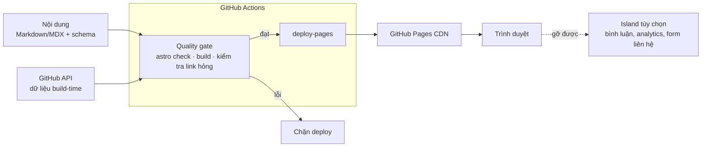

# SoJDev Site — Tài liệu kiến trúc

Cập nhật: 27/09/2026 · Tác giả: Lê Hoàng Lâm · Tài liệu phái sinh: [content-system.md](./content-system.md) (kiến trúc thông tin: trang, URL, phân loại)

## Bối cảnh chung

Site của SoJDev là một site tĩnh (SSG) build bằng Astro, host trên GitHub Pages, nội dung là Markdown trong repo, tiếng Việt ở URL gốc. Sáu quyết định dưới đây đã được chốt để hiện thực hoá hướng đó.

**Mục tiêu.** Xây thương hiệu cá nhân SoJDev qua hai loại nội dung: dự án (portfolio) và bài viết kỹ thuật (blog).

**Đặc điểm tải.** Đọc nhiều, ghi ít, một tác giả. Không có dữ liệu người dùng, không có giao dịch.

**Ràng buộc cứng từ GitHub Pages** ([GitHub Pages limits](https://docs.github.com/en/pages/getting-started-with-github-pages/github-pages-limits)):

- Site đã publish tối đa 1 GB; repo nguồn khuyến nghị tối đa 1 GB.
- Deploy timeout sau 10 phút.
- Băng thông giới hạn mềm 100 GB/tháng.
- Giới hạn mềm 10 build/giờ, không áp dụng khi build bằng GitHub Actions workflow tùy chỉnh.
- Không dùng cho kinh doanh online, e-commerce hay SaaS.
- Chỉ phục vụ file tĩnh: không có logic phía server, không tùy chỉnh HTTP headers, không redirect phía server.

**Giả định cần xác nhận:**

- Dưới 200 bài viết trong vài năm tới.
- Chỉ một người biên tập (tác giả).
- Sẽ dùng custom domain; chưa có domain. Code không phụ thuộc vào việc này (ADR-005).

**Danh mục quyết định:**

| ADR | Quyết định | Lựa chọn | Trạng thái |
| --- | --- | --- | --- |
| ADR-001 | Loại ứng dụng | SSG thuần, không có runtime server | Accepted |
| ADR-002 | Framework SSG | Astro (TypeScript) | Accepted |
| ADR-003 | Nguồn sự thật nội dung | Markdown/MDX trong repo + schema | Accepted |
| ADR-004 | Phần API của JAMstack | Build-time trước, client-side tùy chọn | Accepted |
| ADR-005 | Hosting và CI/CD | Repo `<user>.github.io` + GitHub Actions | Accepted |
| ADR-006 | Ngôn ngữ | Tiếng Việt ở gốc, sẵn sàng thêm tiếng Anh | Accepted |

## ADR-001: Loại ứng dụng — SSG thuần

Mọi trang được render thành HTML lúc build; không có server, database hay serverless function lúc chạy.

**Ngày:** 27/09/2026 · **Người quyết định:** Lê Hoàng Lâm · **Trạng thái:** theo bảng danh mục

### Bối cảnh

GitHub Pages chỉ phục vụ file tĩnh. Nội dung là bài viết và case study, thay đổi theo nhịp tác giả đăng bài, không theo từng request. Không có trạng thái người dùng cần lưu.

### Quyết định

SSG thuần: output của build là một thư mục HTML/CSS/JS/ảnh, deploy nguyên trạng lên GitHub Pages.

### Các phương án

| Phương án | Độ phức tạp | Chi phí | Khả năng mở rộng | Ghi chú |
| --- | --- | --- | --- | --- |
| **SSG thuần (chọn)** | Thấp | 0 đ | Do CDN của GitHub Pages gánh | HTML có sẵn nội dung, tốt cho SEO |
| SPA render phía client | Trung bình | 0 đ | Như trên | HTML ban đầu rỗng; deep link cần mẹo 404.html; kém cho SEO |
| SSR / serverless | Cao | Cần host khác | Theo nền tảng | Không chạy được trên GitHub Pages |

### Phân tích trade-off

SSG đổi tính tươi mới theo thời gian thực lấy sự đơn giản và tính di động. Với blog và portfolio, nội dung chỉ cũ bằng lần build gần nhất, và điều đó chấp nhận được.

### Hệ quả

- **Dễ hơn:** chuyển host gần như không tốn chi phí, vì output chỉ là thư mục `dist/`. Không có bề mặt tấn công phía server.
- **Khó hơn:** không có HTTP headers tùy chỉnh (CSP chỉ đặt được qua thẻ `<meta>`), không có redirect phía server. Mọi tính năng động phải đi qua ADR-004.
- **Xem lại khi:** SoJDev cần tính năng thương mại hoặc cần xử lý phía server thật sự (đăng nhập, thanh toán).

## ADR-002: Framework SSG — Astro

Dùng Astro bản mới nhất với TypeScript; React chỉ xuất hiện dưới dạng island khi một thành phần cần tương tác.

**Ngày:** 27/09/2026 · **Người quyết định:** Lê Hoàng Lâm · **Trạng thái:** theo bảng danh mục

### Bối cảnh

Stack chính của tác giả là Next.js và TypeScript. Nhưng site này chạy ở chế độ tĩnh (ADR-001), nên tiêu chí chính là: framework phục vụ nội dung trên host tĩnh tốt đến đâu.

### Quyết định

Astro, deploy bằng GitHub Action chính thức. Khởi tạo trên phiên bản mới nhất (tài liệu Astro hiện đã có hướng dẫn nâng cấp lên v7.0), không copy từ template cũ.

### Các phương án

| Phương án | Độ phức tạp | Mức quen thuộc | JS gửi xuống client | Ghi chú |
| --- | --- | --- | --- | --- |
| **Astro (chọn)** | Thấp | Mới, nhưng dùng TypeScript và React được | Mặc định không có; chỉ island | Content collections có schema; có [Action deploy chính thức](https://docs.astro.build/en/guides/deploy/github/) |
| Next.js (`output: 'export'`) | Trung bình | Cao | React runtime trên mọi trang | Mất ISR, Image Optimization với loader mặc định, Redirects, Headers, Server Actions, Draft Mode ([static exports](https://nextjs.org/docs/app/guides/static-exports)) |
| Hugo / Jekyll | Thấp | Thấp (Go template / Liquid) | Ít | Không tận dụng được TypeScript và hệ sinh thái npm |

### Phân tích trade-off

Next.js thắng về mức quen thuộc. Nhưng ở chế độ static export, phần lớn tính năng làm nó đáng dùng bị tắt, trong khi chi phí React runtime vẫn còn. Astro được thiết kế cho đúng loại site này và vẫn giữ được TypeScript.

Về tín hiệu tuyển dụng: portfolio chứng minh năng lực qua các dự án nó trình bày, không qua framework của chính site.

### Hệ quả

- **Dễ hơn:** trang gần như không có JS. Schema nội dung được kiểm tra lúc build. Pipeline deploy chỉ cần vài dòng cấu hình.
- **Khó hơn:** phải học cú pháp `.astro` và mô hình island.
- **Điều kiện đảo ngược:** site cần những trang tương tác phức tạp chiếm phần lớn nội dung (ví dụ demo sống của dự án) → cân nhắc lại Next.js.

## ADR-003: Nguồn sự thật nội dung — Markdown/MDX trong repo

Nội dung nằm trong repo dưới dạng Markdown/MDX, được kiểm tra bằng schema của content collections; Git là CMS.

**Ngày:** 27/09/2026 · **Người quyết định:** Lê Hoàng Lâm · **Trạng thái:** theo bảng danh mục

### Bối cảnh

Một tác giả, quen Git, viết bài kỹ thuật có code. Cần lịch sử chỉnh sửa và cần lỗi frontmatter bị bắt trước khi lên site.

### Quyết định

Hai collection, file xếp theo ngôn ngữ (ADR-006). Frontmatter sai schema thì build thất bại.

| Collection | Vị trí | Trường |
| --- | --- | --- |
| `blog` | `src/content/blog/vi/*.md(x)` | `title`, `description`, `slug`, `pubDate`, `updatedDate?`, `tags[]`, `draft`, `cover?` |
| `projects` | `src/content/projects/vi/*.md(x)` | `title`, `summary`, `slug`, `role`, `stack[]`, `problem`, `decisions[]` (`title`, `rationale`), `outcome`, `repoUrl?`, `liveUrl?`, `featured`, `order` |

Cấu trúc `problem → decisions → outcome` của `projects` là chủ ý. Nó ép mỗi case study trình bày vấn đề, quyết định và kết quả, thay vì một danh sách tính năng.

`slug` bắt buộc ở cả hai collection và được dùng làm id của entry, nên URL không phụ thuộc tên file. Schema kiểm tra slug (và tag) bằng regex ASCII; slug trùng trong một collection làm build thất bại. Schema nằm ở `src/content.config.ts`, hàm `slugify` ở `src/lib/slug.ts`.

Kiến trúc thông tin mở rộng schema này theo cách cộng thêm: collection `tags` làm từ vựng có kiểm soát, `blog.tags[]` thành tham chiếu 1–4 phần tử, và `blog.relatedProjects?` ([content-system.md — Thay đổi schema](./content-system.md#thay-đổi-schema-so-với-adr-003)).

### Các phương án

| Phương án | Độ phức tạp | Chi phí | Ghi chú |
| --- | --- | --- | --- |
| **Markdown trong repo + schema (chọn)** | Thấp | 0 đ | Versioned cùng code; review bằng diff |
| CMS dựa trên Git (Decap, Keystatic, Pages CMS) | Trung bình | 0 đ | Có giao diện soạn thảo; thêm một lớp cấu hình và xác thực |
| Headless CMS (Sanity, Contentful…) | Cao | Có thể phát sinh | Nội dung nằm ngoài repo; cần webhook để rebuild |

### Phân tích trade-off

Markdown trong repo đổi trải nghiệm soạn thảo (không có editor đồ hoạ, khó viết từ điện thoại) lấy sự đơn giản và quyền sở hữu nội dung thô. Với một tác giả dùng Git hằng ngày, cái giá đó thấp.

### Hệ quả

- **Dễ hơn:** mọi thay đổi nội dung có lịch sử Git. Không phụ thuộc dịch vụ bên ngoài.
- **Khó hơn:** đăng bài phải qua commit và push.
- **Điều kiện đảo ngược:** cần viết từ điện thoại hoặc có người biên tập không dùng Git → thêm CMS dựa trên Git, giữ nguyên Markdown làm nguồn sự thật.

## ADR-004: Phần API — build-time trước, client-side tùy chọn

Dữ liệu ngoài được lấy lúc build nếu có thể; dịch vụ phía client chỉ là island gỡ được, hỏng thì trang vẫn đọc được.

**Ngày:** 27/09/2026 · **Người quyết định:** Lê Hoàng Lâm · **Trạng thái:** theo bảng danh mục

### Bối cảnh

Không có server (ADR-001), nên mọi tính năng động phải đến từ lúc build hoặc từ dịch vụ bên thứ ba gọi từ trình duyệt. Rủi ro chính là tính năng "để dành" trở thành phụ thuộc ẩn.

### Quyết định

Thứ tự ưu tiên:

1. **Build-time.** Ví dụ kéo dữ liệu repo từ GitHub API rồi ghi thành HTML tĩnh. Token nằm trong secret của Actions, không lộ ra client. Có thể thêm một workflow chạy theo lịch để rebuild.
2. **Client-side từ dịch vụ bên thứ ba**, mỗi thứ là một island độc lập:
   - Bình luận (ví dụ loại dùng GitHub Discussions).
   - Analytics hướng quyền riêng tư.
   - Form liên hệ qua dịch vụ form, hoặc `mailto:`.
3. **Tìm kiếm:** index tĩnh tạo lúc build, chỉ thêm khi đã có vài chục bài; trước đó dùng trang tag.

### Các phương án

| Phương án | Độ phức tạp | Độ tươi dữ liệu | Ghi chú |
| --- | --- | --- | --- |
| **Build-time trước (chọn)** | Thấp | Bằng lần build gần nhất | Không lộ token; không tốn JS |
| Gọi API từ client cho mọi thứ | Trung bình | Thời gian thực | Giới hạn rate của API rơi vào người đọc; trang phụ thuộc mạng ngoài |
| Tự dựng backend riêng | Cao | Thời gian thực | Trái ADR-001; cần host và vận hành |

### Phân tích trade-off

Dữ liệu build-time có thể cũ vài ngày, nhưng với số sao hay danh sách repo thì độ trễ đó không ảnh hưởng người đọc. Đổi lại, trang nhanh và không hỏng khi dịch vụ ngoài hỏng.

### Hệ quả

- **Dễ hơn:** mỗi dịch vụ ngoài thêm hoặc gỡ được mà không đụng phần còn lại.
- **Khó hơn:** một số dữ liệu không theo thời gian thực.
- **Ràng buộc:** không tính năng nào ở tầng 2–3 được làm build thất bại nếu gỡ đi.

## ADR-005: Hosting và CI/CD — user site + GitHub Actions

Repo đặt tên `<username>.github.io`, deploy bằng GitHub Actions workflow có quality gate, dùng custom domain cho thương hiệu.

**Ngày:** 27/09/2026 · **Người quyết định:** Lê Hoàng Lâm · **Trạng thái:** theo bảng danh mục

### Bối cảnh

GitHub Pages cho mỗi tài khoản đúng một user site. Project repo thì publish dưới `/<repo>/`, buộc phải cấu hình `base` và thêm tiền tố vào mọi link nội bộ ([Astro — GitHub Pages](https://docs.astro.build/en/guides/deploy/github/)).

### Quyết định

- **Repo:** `<username>.github.io`, không cấu hình `base`.
- **Nguồn Pages:** đặt Source là GitHub Actions.
- **Workflow** theo tài liệu Astro hiện tại: `actions/checkout@v7` → `actions/configure-pages@v6` → `withastro/action@v6` (Node mặc định 24) → `actions/deploy-pages@v5`.
- **Quality gate trước deploy:** `astro check`, build (bao gồm kiểm tra schema), kiểm tra link hỏng. Cả ba nằm trong script `build`, nên chạy giống nhau ở máy và ở CI. Kiểm tra link là integration `src/integrations/check-links.ts`, chạy sau khi build xong. Nó làm build thất bại khi link nội bộ trỏ tới file không tồn tại hoặc thiếu dấu `/` cuối (IA-001). Link ngoài không được kiểm, để lỗi mạng của site khác không chặn deploy.
- **Lockfile** được commit, vì action dựa vào đó để nhận diện package manager.
- **Domain không nằm trong code.** Custom domain đặt ở Settings → Pages; khi deploy bằng Actions, file `CNAME` bị bỏ qua và không cần ([GitHub Docs](https://docs.github.com/en/pages/configuring-a-custom-domain-for-your-github-pages-site/managing-a-custom-domain-for-your-github-pages-site)). `configure-pages` đọc origin hiện tại (github.io hoặc custom domain) và truyền cho build qua `SITE_URL`; `astro.config.mjs` dùng giá trị này làm `site`, và làm build thất bại nếu thiếu ở CI. Không có `base`.

### Các phương án

| Phương án | Độ phức tạp | Chi phí | Ghi chú |
| --- | --- | --- | --- |
| **User site + Actions (chọn)** | Thấp | 0 đ (domain tính riêng) | Không có `base`; giới hạn 10 build/giờ không áp dụng |
| Project repo + Actions | Trung bình | 0 đ | Phải có `base`, dễ lỗi link |
| Cloudflare Pages / Netlify | Thấp | Gói miễn phí | Có headers và redirect; là đường thoát nếu vượt giới hạn GitHub Pages |

### Phân tích trade-off

GitHub Pages thua các host tĩnh khác về headers và redirect, nhưng gộp code, CI và hosting vào một nơi. Vì output là thư mục tĩnh (ADR-001), chuyển sang host khác chỉ là đổi bước deploy.

### Hệ quả

- **Dễ hơn:** mỗi lần push lên `main` là một lần deploy đã qua kiểm tra. Custom domain giúp URL không bị gắn chặt vào GitHub.
- **Khó hơn:** không có preview deploy cho từng pull request.
- **Điều kiện đảo ngược:** chạm giới hạn mềm 100 GB/tháng, cần HTTP headers hoặc redirect thật, hoặc site có mục đích thương mại → chuyển host tĩnh khác.

## ADR-006: Ngôn ngữ — tiếng Việt trước, sẵn sàng song ngữ

Tiếng Việt nằm ở URL gốc; tiếng Anh thêm sau dưới `/en/` mà không URL cũ nào đổi. Chỉ chốt ngay những gì không đảo ngược được.

**Ngày:** 27/09/2026 · **Người quyết định:** Lê Hoàng Lâm · **Trạng thái:** theo bảng danh mục

### Bối cảnh

Blog viết bằng tiếng Việt; tiếng Anh chỉ thêm khi tác giả đã có thói quen viết đều. URL và slug là thứ đắt nhất để đổi về sau, vì đã bị index và chia sẻ, và GitHub Pages không có redirect phía server.

### Quyết định

**Chốt ngay:**

- Tiếng Việt ở gốc, không tiền tố `/vi/`. Với Astro, `prefixDefaultLocale: false` là mặc định: ngôn ngữ mặc định không có tiền tố, các ngôn ngữ khác thì có ([Astro i18n](https://docs.astro.build/en/guides/internationalization/)).
- Slug ASCII bỏ dấu, ví dụ `/blog/kien-truc-jamstack/`. Chuẩn hoá bằng NFD, bỏ dấu kết hợp, xử lý riêng `đ → d`. Slug bất biến sau khi đăng.
- File xếp theo ngôn ngữ ngay từ đầu: `src/content/blog/vi/`.
- `<html lang="vi">`; font có subset `vietnamese`; ngày định dạng qua `Intl.DateTimeFormat(locale)`.

**Để sau (khi bật tiếng Anh):** cấu hình `i18n`, thư mục `src/pages/en/`, từ điển chuỗi UI, trường `translationKey` để ghép cặp bản dịch, `hreflang`, RSS và sitemap theo ngôn ngữ.

**Không làm, kể cả khi đã song ngữ:**

- Fallback kiểu rewrite: nó hiển thị nội dung ngôn ngữ khác tại URL của ngôn ngữ còn thiếu, gây trùng nội dung và sai `lang`. Thay vào đó, `/en/blog/` chỉ liệt kê bài đã dịch, nút chuyển ngôn ngữ chỉ hiện khi bản dịch tồn tại.
- Tự phát hiện ngôn ngữ trình duyệt: `Astro.preferredLocale` chỉ có trên trang render theo yêu cầu, không có trên trang tĩnh.

### Các phương án

| Phương án | Độ phức tạp | URL khi thêm tiếng Anh | Ghi chú |
| --- | --- | --- | --- |
| **Tiếng Việt ở gốc (chọn)** | Thấp | URL tiếng Việt giữ nguyên | Không cần redirect |
| Tiền tố cho mọi ngôn ngữ (`/vi/`, `/en/`) | Trung bình | Giữ nguyên | URL không tiền tố trả 404 nếu không cấu hình fallback; phức tạp cho một ngôn ngữ chưa tồn tại |
| Không chuẩn bị gì | Thấp nhất | Có thể phải đổi slug hoặc di chuyển file | Chi phí dồn về sau |

### Phân tích trade-off

Chọn tiếng Việt ở gốc chấp nhận sự bất đối xứng giữa hai ngôn ngữ trong URL, đổi lấy việc không bao giờ phải di trú URL. Song ngữ gần như nhân đôi chi phí duy trì mỗi bài, nên việc bật tiếng Anh cần một điều kiện quan sát được.

Trang About và Projects có thể cần tiếng Anh sớm hơn blog nếu một phần nhà tuyển dụng đọc tiếng Anh. Kiến trúc này cho phép dịch riêng các trang đó.

### Hệ quả

- **Dễ hơn:** thêm tiếng Anh là thay đổi thuần cộng thêm, không sửa nội dung cũ.
- **Khó hơn:** mỗi lần sửa bài gốc phải đồng bộ bản dịch (khi đã song ngữ).
- **Điều kiện kích hoạt tiếng Anh:** một ngưỡng tác giả tự đặt, ví dụ số bài liên tục trong một khoảng thời gian. Ngưỡng cụ thể chưa chốt.

## Kiến trúc tổng hợp

Sáu quyết định gộp lại thành một pipeline một chiều: nội dung và dữ liệu vào lúc build, HTML tĩnh ra CDN.



Mọi thay đổi đi qua quality gate trước khi deploy; island phía trình duyệt nằm ngoài đường chính và gỡ được (ADR-004).

### Cấu trúc repo

```
<username>.github.io/
├─ .github/workflows/deploy.yml
├─ public/                 # favicon, robots.txt, OG mặc định
├─ src/
│  ├─ content/
│  │  ├─ blog/vi/           # *.md(x)
│  │  ├─ projects/vi/
│  │  └─ tags/              # từ vựng tag (IA-002)
│  ├─ content.config.ts    # schema các collection
│  ├─ lib/                 # slug.ts, hàm lọc draft dùng chung
│  ├─ integrations/        # check-links.ts (quality gate)
│  ├─ layouts/             # Base, Post, Project
│  ├─ components/          # thuần Astro; island chỉ khi cần tương tác
│  ├─ pages/               # xem sơ đồ trang ở content-system.md (IA-001)
│  │                       # index, about, 404, rss.xml, blog/{index,[slug]},
│  │                       # projects/{index,[slug]}, tags/{index,[tag]}
│  └─ styles/              # design tokens của SoJDev
└─ astro.config.mjs        # site (từ SITE_URL), trailingSlash, integrations: check-links, sitemap, mdx
```

Tầng SEO và thương hiệu sinh ra lúc build: sitemap, RSS, canonical URL, Open Graph image theo bài, JSON-LD (`WebSite` ở trang chủ, `BlogPosting` ở bài viết, `Person` ở trang About). Chi tiết theo loại trang nằm ở [content-system.md — Metadata theo loại trang](./content-system.md#metadata-theo-loại-trang).

### Stress test: traffic tăng 100 lần

Thứ chạm trần đầu tiên là giới hạn mềm 100 GB/tháng, không phải server. Phần lớn băng thông đến từ ảnh.

1. Tối ưu ảnh lúc build (định dạng hiện đại, nhiều kích thước).
2. Đặt CDN phía trước.
3. Chuyển sang host tĩnh khác; vì output chỉ là `dist/`, việc này chỉ đổi bước deploy.

## Stop rules

Những thứ không đưa vào kiến trúc ở phạm vi hiện tại:

- Không database, không SSR, không serverless function (ADR-001).
- Không headless CMS, không monorepo (ADR-003).
- Không cấu hình `i18n` trước khi đạt ngưỡng bật tiếng Anh (ADR-006).
- Không tính năng "để dành" nào được thành phụ thuộc ẩn: bình luận, tìm kiếm, newsletter phải gỡ được mà build không hỏng (ADR-004).

## Spike kiểm chứng

Các ADR đã chốt về hướng; ba spike dưới đây cung cấp bằng chứng thực nghiệm mà tài liệu này chưa có.

- [x] **Khởi tạo và deploy thật** (ADR-002, ADR-005): Astro bản mới nhất trên repo `<username>.github.io`, deploy bằng workflow chính thức, ghi lại thời gian build.
- [x] **Kiểm tra schema** (ADR-003, ADR-006): viết 2 bài blog và 2 case study; xác nhận slug ASCII và cấu trúc `problem → decisions → outcome` dùng được. Kết quả ngày 27/09/2026:
  - Slug có dấu, tag có dấu, thiếu slug, thiếu `decisions`, `updatedDate` trước `pubDate` đều làm build thất bại.
  - Slug trùng **không** bị Astro 7.3.5 chặn: check có sẵn chỉ là cảnh báo, và trên data store sạch (mọi lần build ở CI) nó không chạy được vì loader xử lý file song song. Đã tự kiểm tra trong `generateId`.
  - Với dự án có quyết định kiến trúc rõ (chính site này), cấu trúc dùng tự nhiên. Bản nháp case study DevOverflow (dự án làm theo khoá học) cho thấy cấu trúc buộc tách phần theo bài giảng khỏi phần tự quyết, và `role` phải gánh sắc thái đó. Bản nháp đã gỡ khỏi repo; case study này viết lại sau khi xong đợt refactor kiến trúc của DevOverflow.
  - Còn mở: `problem`, `decisions`, `outcome` bị viết hai lần, một bản tóm tắt trong frontmatter và một bản chi tiết trong thân bài. Đã giải quyết ngày 28/09/2026 bằng IA-007 trong [content-system.md](./content-system.md): mỗi bản có vai trò riêng, và build kiểm hai bản khớp nhau. `outcome` của `sojdev-site` chưa có số liệu; sẽ cập nhật sau spike "Đo baseline", đồng thời dùng làm phép thử cho việc cập nhật một case study đã có.
- [ ] **Đo baseline** (ADR-001, ADR-004): chạy Lighthouse trước khi thêm bất kỳ island nào.
- [x] **Kiểm tra IA** (ADR-003, ADR-005): collection `tags` và tham chiếu từ `blog`, `relatedProjects`. Phần dấu `/` cuối đã xong. Kết quả ở [content-system.md — Spike kiểm chứng](./content-system.md#spike-kiểm-chứng).

## Điểm chưa kiểm chứng

- Tùy chọn i18n của sitemap integration trên Astro v7.
- Giới hạn và điều khoản hiện tại của dịch vụ bình luận, analytics, form cụ thể (ADR-004).
- Khả năng headers và redirect của Cloudflare Pages / Netlify ở gói miễn phí (đường thoát của ADR-005).
- Sau khi gắn custom domain, `lhlam2515.github.io/<đường dẫn>` có được chuyển 301 sang domain mới, giữ nguyên đường dẫn hay không. Nếu có, link đã chia sẻ trước đó vẫn sống; canonical tự đổi theo `SITE_URL` ở lần build kế tiếp. Nên gắn domain trước khi đăng bài thật để tránh phụ thuộc vào redirect này.
- Ngưỡng cụ thể để bật tiếng Anh (ADR-006).

## Nguồn

- [GitHub Pages limits — GitHub Docs](https://docs.github.com/en/pages/getting-started-with-github-pages/github-pages-limits)
- [Deploy your Astro Site to GitHub Pages — Astro Docs](https://docs.astro.build/en/guides/deploy/github/)
- [Internationalization (i18n) Routing — Astro Docs](https://docs.astro.build/en/guides/internationalization/)
- [Static exports — Next.js Docs](https://nextjs.org/docs/app/guides/static-exports)
