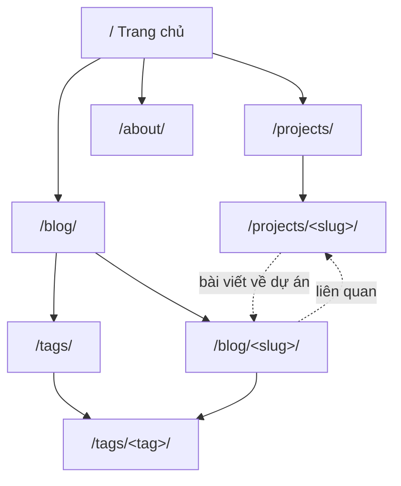

# SoJDev Site — Kiến trúc thông tin

Cập nhật: 28/09/2026 · Tác giả: Lê Hoàng Lâm · Tài liệu nền: [architecture.md](./architecture.md)

## Phạm vi

Tài liệu này quyết định **cấu trúc** của nội dung: có những trang nào, URL ra sao, người đọc đi từ đâu đến đâu, nội dung được phân loại và liên kết thế nào. Nó không quyết định viết về chủ đề gì (chiến lược nội dung) hay quy trình đăng bài. Riêng khung của một case study (phần nào ở frontmatter, phần nào ở thân bài, dài bao nhiêu) được quyết định ở IA-007.

Mọi quyết định ở đây kế thừa sáu ADR đã chốt. Chỗ nào cần mở rộng schema của ADR-003 được ghi rõ ở mục [Thay đổi schema](#thay-đổi-schema-so-với-adr-003).

## Drivers

**Người đọc và đường vào:**

| Người đọc | Đường vào điển hình | Cần tìm thấy nhanh |
| --- | --- | --- |
| Nhà tuyển dụng / tech lead | Link từ CV, LinkedIn → trang chủ hoặc About | Định vị SoJDev, 2–3 dự án tiêu biểu, cách liên hệ |
| Developer | Tìm kiếm hoặc link chia sẻ → thẳng vào một bài | Nội dung bài, rồi bài liên quan |
| Tác giả | Repo | Biết đặt file ở đâu, gắn tag gì mà không phải nghĩ |

**Ràng buộc kế thừa:**

- URL và slug bất biến sau khi đăng; GitHub Pages không có redirect phía server (ADR-001, ADR-006). Hệ quả: **mọi quyết định về URL là quyết định không đảo ngược được**, nên được chốt trước mọi thứ khác.
- Dưới 200 bài trong vài năm, một tác giả (giả định trong architecture.md).
- Tiếng Việt ở gốc, tiếng Anh dưới `/en/` sau này (ADR-006).
- Không tìm kiếm cho đến khi có vài chục bài; trước đó trang tag đảm nhận việc khám phá (ADR-004).

**Danh mục quyết định:**

| IA | Quyết định | Lựa chọn | Đảo ngược được? |
| --- | --- | --- | --- |
| IA-001 | Sơ đồ trang và URL | 4 khu vực phẳng, URL không chứa ngày | Không |
| IA-002 | Phân loại | Một tầng tag, từ vựng có kiểm soát | Slug tag: không. Còn lại: có |
| IA-003 | Liên kết chéo | Bài → dự án lưu một chiều, chiều ngược tính lúc build | Có |
| IA-004 | Điều hướng | 3 mục chính; tag không lên menu | Có |
| IA-005 | Trang danh sách | Không phân trang; blog nhóm theo năm | Có |
| IA-006 | Trang chủ | Định vị + dự án nổi bật + bài mới | Có |
| IA-007 | Nội dung case study | Frontmatter là overview các quyết định, thân bài là bằng chứng; 2–4 quyết định | Có |
| IA-008 | Nội dung trang chủ và Giới thiệu | Mỗi trang một file Markdown có schema; `.astro` chỉ giữ bố cục | Có |

## IA-001: Sơ đồ trang và URL

### Quyết định

| Trang | URL | Nguồn dữ liệu |
| --- | --- | --- |
| Trang chủ | `/` | `home` (định vị) + `projects` (featured) + `blog` (mới nhất) |
| Danh sách dự án | `/projects/` | `projects` |
| Case study | `/projects/<slug>/` | một entry `projects` |
| Danh sách bài | `/blog/` | `blog` |
| Bài viết | `/blog/<slug>/` | một entry `blog` |
| Mọi tag | `/tags/` | từ vựng tag + số bài |
| Một tag | `/tags/<tag>/` | `blog` lọc theo tag |
| Giới thiệu | `/about/` | `about` + `projects` (featured), JSON-LD `Person` |
| RSS | `/rss.xml` | `blog`, bỏ draft |
| Không tìm thấy | `/404.html` | trang tĩnh |

**Quy ước URL:**

- **Không có ngày trong URL** (loại `/2026/09/<slug>/`). Bài kỹ thuật được cập nhật (`updatedDate`); ngày trong URL làm bài trông cũ dù nội dung mới, và không thể sửa vì slug bất biến.
- **Không có category trong URL** (loại `/blog/frontend/<slug>/`). Phân loại có thể đổi; URL thì không.
- **Luôn có dấu `/` ở cuối.** Canonical, sitemap và link nội bộ đều dùng dạng này, khớp với cách GitHub Pages phục vụ `index.html` trong thư mục. Cấu hình: `trailingSlash: "always"`, `build.format: "directory"`. Link nội bộ thiếu dấu `/` làm build thất bại (kiểm tra link của ADR-005).
- **Slug dự án** theo cùng quy tắc ASCII bỏ dấu của ADR-006 và cũng bất biến.
- **Trang 404 là đường cứu hộ duy nhất** khi không có redirect: nó có link tới `/blog/`, `/projects/`, `/tags/`.

### Các phương án

| Phương án | Ưu | Nhược |
| --- | --- | --- |
| **`/blog/<slug>/` phẳng (chọn)** | Ngắn, bền, khớp ví dụ ADR-006 | Không thể hiện thời gian hay chủ đề trong URL |
| `/<slug>/` ở gốc | Ngắn nhất | Trùng không gian tên với `/about/`, `/projects/`, tag; khó thêm khu vực mới |
| `/YYYY/MM/<slug>/` | Không lo trùng slug | Bài trông cũ; khoá cứng ngày |
| `/blog/<category>/<slug>/` | URL mô tả chủ đề | Đổi category là vỡ URL |

### Hệ quả

- Thêm khu vực mới (ví dụ `/notes/`) là thay đổi cộng thêm, không đụng URL cũ.
- Slug bài phải là duy nhất trong toàn bộ `blog`. Điều này đã được kiểm tra lúc build bằng `slugId()` trong `src/content.config.ts` (xem [Kiểm tra lúc build](#kiểm-tra-lúc-build)).

## IA-002: Phân loại — một tầng tag, từ vựng có kiểm soát

### Bối cảnh

Với một tác giả, rủi ro chính của tag không phải thiếu mà là trôi: `ai-agent`, `ai-agents`, `agents` cùng tồn tại, mỗi cái có trang riêng với một bài. Slug tag lại nằm trong URL (`/tags/<tag>/`), nên đổi tên sau này cũng vỡ link như đổi slug bài.

### Quyết định

- **Một tầng, không category.** Dưới 200 bài, hai tầng phân loại (category + tag) buộc mỗi bài trả lời hai câu hỏi phân loại mà người đọc không cần.
- **Từ vựng có kiểm soát:** tag được khai báo trong một collection dữ liệu riêng. Bài gắn tag chưa khai báo thì build thất bại.
- **Mỗi bài 1–4 tag.** Giới hạn được kiểm tra bằng schema.
- **Slug tag là ID bền, luôn là thuật ngữ tiếng Anh** (`astro`, `testing`, `requirements-engineering`, `ai-agents`), để giữ đúng thuật ngữ của chủ đề. Không dùng tiếng Việt bỏ dấu cho slug tag. Nhãn hiển thị thì theo ngôn ngữ (`label.vi`, sau này `label.en`).
- **Một số tag được đánh dấu `featured`** để hiện thành các nút lọc ở đầu `/blog/`. Đây là cách thể hiện các chủ đề trọng tâm mà không cần tầng category.
- **Trang `/tags/<tag>/` chỉ sinh ra khi tag có ít nhất một bài đã đăng.** Tag chỉ gắn với bài draft thì không có trang.

### Các phương án về slug tag

| Phương án | Ưu | Nhược |
| --- | --- | --- |
| **Thuật ngữ tiếng Anh, nhãn theo ngôn ngữ (chọn, chốt 27/09/2026)** | Giữ đúng thuật ngữ chủ đề; một slug dùng chung cho `/tags/x/` và `/en/tags/x/` | URL tiếng Việt lẫn tiếng Anh |
| Tiếng Việt bỏ dấu (`kiem-thu`) | Nhất quán với slug bài | Lệch thuật ngữ gốc; khi song ngữ phải có hai slug cho một khái niệm, cần bảng ánh xạ |
| Tag tự do, không khai báo | Không ma sát khi viết | Trôi từ vựng; trang tag mỏng |

Quy tắc: **một khái niệm, một slug tiếng Anh, không bao giờ đổi.** Slug viết thường, các từ nối bằng gạch ngang.

### Hệ quả

- **Khó hơn:** thêm tag mới là hai bước (khai báo, rồi gắn). Đây là ma sát có chủ ý.
- **Để sau:** `series` cho bài nhiều phần. Series không nằm trong URL bài (bài vẫn ở `/blog/<slug>/`), nên thêm sau không phá gì. Thêm khi có series thật đầu tiên.
- **Điều kiện đảo ngược:** một tag vượt khoảng 40 bài và người đọc cần lọc sâu hơn → cân nhắc tầng thứ hai. Tag cũ vẫn giữ URL.

## IA-003: Liên kết chéo giữa bài viết và dự án

### Bối cảnh

Hai loại nội dung phục vụ hai người đọc khác nhau, nhưng giá trị thương hiệu nằm ở chỗ chúng dẫn sang nhau: nhà tuyển dụng đọc case study thấy có bài phân tích sâu; developer đọc bài thấy nó xuất phát từ một dự án thật.

### Quyết định

- **Lưu một chiều:** bài viết khai báo `relatedProjects` (tham chiếu tới entry `projects`). Dự án không lưu danh sách bài.
- **Chiều ngược tính lúc build:** trang `/projects/<slug>/` có mục "Bài viết liên quan", lọc từ mọi bài có tham chiếu tới dự án đó.
- **Bài liên quan trên trang bài:** tối đa 3 bài, xếp theo số tag trùng, rồi theo ngày mới hơn. Không có bài nào trùng tag thì bỏ mục này, không lấp bằng bài ngẫu nhiên.
- **`stack[]` của dự án không phải taxonomy.** Nó mô tả công nghệ, có thể rất chi tiết; không sinh trang tag.

### Các phương án

| Phương án | Ưu | Nhược |
| --- | --- | --- |
| **Một chiều + tính ngược (chọn)** | Một nguồn sự thật; không thể lệch | Liên kết chỉ khởi tạo được từ phía bài |
| Lưu hai chiều | Mỗi phía tự khai báo | Sửa một bên quên bên kia là lệch |
| Gộp `stack` vào tag | `/tags/astro/` liệt kê cả dự án | Từ vựng tag phình theo từng thư viện nhỏ |

### Hệ quả

- **Điều kiện đảo ngược:** muốn `/tags/<tag>/` hiện cả dự án → thêm `tags?` vào `projects`, dùng chung từ vựng IA-002. Thay đổi cộng thêm, không đụng URL.

## IA-004: Điều hướng

### Quyết định

- **Header:** logo SoJDev (về `/`) và 3 mục: **Dự án**, **Blog**, **Giới thiệu**. Thứ tự đặt Dự án trước vì đó là bằng chứng năng lực cho người đọc đến từ CV.
- **Tag không lên menu chính.** Đường vào tag: nút lọc `featured` trên `/blog/`, tag trên mỗi bài, link "Mọi chủ đề" tới `/tags/`.
- **Footer:** RSS, GitHub, LinkedIn, email; về sau thêm nút chuyển ngôn ngữ.
- **Không breadcrumb.** Độ sâu tối đa là hai cấp; mỗi trang chi tiết có một link quay về danh sách của nó.
- **Trang bài:** tiêu đề, dẫn (`description`), ngày đăng, ngày cập nhật (nếu có), tag, nội dung, dự án liên quan, bài liên quan. Đầu trang theo thứ tự của case study: tiêu đề, dẫn, rồi ngày và tag dưới một vạch (28/09/2026).

### Hệ quả

- Menu không phải đổi khi số bài hay số tag tăng.
- **Điều kiện đảo ngược:** thêm khu vực cấp cao thứ tư (ví dụ `/notes/`) → xem lại menu; nếu vượt 4 mục, gom bớt.

## IA-005: Trang danh sách

### Quyết định

- **`/blog/`:** mọi bài đã đăng trên một trang, nhóm theo năm, mới nhất trước. Mỗi dòng: tiêu đề, ngày, `description`. Nút lọc tag `featured` ở đầu trang là link tới `/tags/<tag>/`, không lọc bằng JavaScript.
- **Không phân trang.** Vài trăm dòng chỉ gồm tiêu đề và mô tả là một trang HTML nhẹ. Phân trang tạo ra các URL `/blog/2/` có nội dung dịch chuyển mỗi lần đăng bài, và người đọc phải bấm qua nhiều trang để quét.
- **`/projects/`:** dự án `featured` trước, sau đó theo `order`. Mỗi thẻ: tiêu đề, `summary`, `role`, vài mục `stack`; dự án `featured` có thêm ảnh chụp và nhãn các quyết định (`decisions[].label`, 29/09/2026).
- **`/tags/`:** mọi tag có bài, kèm số bài, xếp theo số bài giảm dần.
- **Loại khỏi mọi danh sách:** bài `draft: true`. Quy tắc này áp dụng giống nhau cho `/blog/`, trang tag, bài liên quan, RSS và sitemap, qua một hàm lọc dùng chung.

### Hệ quả

- **Điều kiện đảo ngược:** HTML của `/blog/` vượt ngưỡng hiệu năng đo bằng Lighthouse ở spike baseline → thêm phân trang. `/blog/` vẫn là trang đầu nên không URL nào hỏng.

## IA-006: Trang chủ

### Quyết định

Trang chủ phục vụ người đọc đến từ CV; developer đến từ tìm kiếm hiếm khi đi qua đây.

1. **Định vị:** một câu nói SoJDev là ai và làm gì, link tới `/about/`. Chữ lấy từ collection `home` (IA-008).
2. **Dự án nổi bật:** tối đa 3 entry `featured: true`, xếp theo `order`, link "Mọi dự án".
3. **Bài mới:** 3–5 bài đã đăng gần nhất, link "Mọi bài viết".
4. **Liên hệ:** các kênh giống footer.

Trang chủ không có nội dung riêng; mọi khối đều lấy từ collection, nên không bao giờ lệch với trang danh sách.

## IA-007: Nội dung case study — frontmatter là overview, thân bài là bằng chứng

### Bối cảnh

Người đọc chính của case study là nhà tuyển dụng và tech lead. Họ cần thấy quá trình suy luận: vấn đề là gì, đã cân nhắc những phương án nào, vì sao chọn, cái giá là gì, và bằng chứng nào cho thấy lựa chọn đó đúng. Một danh sách tính năng không cho thấy điều đó.

Trang `/projects/<slug>/` hiển thị cả hai phần trên cùng một trang: frontmatter thành các mục Vấn đề, Quyết định, Kết quả; thân bài nằm bên dưới (`src/layouts/Project.astro`). Bảng Vấn đề / Quyết định trên trang chủ cũng lấy từ frontmatter; Kết quả không đưa lên trang chủ vì làm thẻ dự án quá dài để lướt (28/09/2026).

Case study đầu tiên (`sojdev-site`, bản ngày 27/09/2026) cho thấy điều gì xảy ra khi hai phần không có vai trò rõ:

- Hai bản lệch nhau. Thân bài có quyết định không nằm trong `decisions[]`, và ngược lại.
- `outcome` không đối chiếu với tiêu chí trong `problem`, và dùng số của giai đoạn scaffold.
- Bằng chứng mạnh nhất, những chỗ công cụ không làm như tài liệu nói và cách đã xử lý, phần lớn nằm ngoài bài.

### Quyết định

**Frontmatter là overview các quyết định; thân bài là bằng chứng và chi tiết.** Người đọc lướt thấy toàn bộ lập luận ở phần trên; người đọc sâu kiểm được từng điểm ở phần dưới.

| Trường | Vai trò | Độ dài (ký tự) | Viết thế nào |
| --- | --- | --- | --- |
| `summary` | Thẻ dự án, meta description | 80–200 | Dự án là gì và điểm đáng chú ý nhất |
| `role` | Phần việc của tác giả | — | Dự án theo khoá học hoặc làm nhóm: ghi rõ phần nào được cho sẵn, phần nào tự quyết |
| `problem` | Vấn đề và tiêu chí thành công | 150–350 | Vấn đề và 2–4 tiêu chí kiểm chứng được |
| `decisions` | Các quyết định kiến trúc | 2–4 phần tử | Xem "Chọn quyết định nào" bên dưới |
| `decisions[].title` | Tên quyết định | 15–70 | Nêu lựa chọn, không chỉ chủ đề: "Astro thay vì Next.js", không phải "Framework" |
| `decisions[].label` | Nhãn trong mục lục | 8–28 | Rút gọn `title`, vẫn nêu lựa chọn: "Astro thay Next.js", "URL bất biến". 28 ký tự vừa một dòng ở cột mục lục 272 và ở 320 |
| `decisions[].rationale` | Tóm tắt lập luận | 120–320 | Khoảng hai câu: chọn gì thay vì gì, vì sao; rồi cái giá chấp nhận |
| `outcome` | Kết quả | 150–350 | Đối chiếu từng tiêu chí của `problem`; nói rõ phần chưa đo |

Giới hạn dưới loại câu kiểu khẩu hiệu, không đủ chỗ cho lý do. Giới hạn trên giữ mỗi trường ở khoảng hai câu, để thẻ quyết định trong lưới 2 × 2 (RD-005) vẫn đọc được và frontmatter không thành bản thứ hai của thân bài.

**Chọn quyết định nào:**

- Chỉ đưa vào `decisions[]` quyết định có **phương án thay thế thật** và có **bằng chứng trong thân bài**.
- Lựa chọn hiển nhiên hoặc chưa có bằng chứng: chỉ nhắc ở cuối thân bài, kèm link tới tài liệu kiến trúc của dự án. Đoạn này nằm trong mục cuối cùng hiện có, không tạo mục `##` riêng.
- Dự án theo khoá học: chỉ đưa quyết định tự đưa ra.

**Thân bài, theo thứ tự:**

1. `## Bối cảnh`: ràng buộc, rủi ro, và vì sao phải tự làm thay vì dùng giải pháp có sẵn.
2. Mỗi quyết định một mục `## <title>`, **trùng tên và thứ tự** với `decisions[]`. Bên trong gồm bốn phần, mỗi phần mở đầu bằng chữ in đậm: **Phương án đã cân nhắc.**, **Vì sao chọn.**, **Bằng chứng.**, **Cái giá.** (kèm điều kiện đảo ngược nếu có). Chúng không phải heading: thân case study chỉ có heading `##`, và `###` trở xuống làm build thất bại (28/09/2026). Bản thử dùng `###` (render thành `<h4>`) cùng ngày cho thấy dưới mỗi mục có hai cấp chữ gần nhau, và bốn heading lặp y hệt ở mọi quyết định; chữ in đậm cùng cỡ với thân bài giữ mỗi mục một cấp.
3. `## Đối chiếu kết quả`: bảng tiêu chí → kết quả → bằng chứng.
4. `## Còn mở` (tuỳ chọn): những gì chưa đo hoặc chưa kiểm chứng, kèm kế hoạch.
5. `## Điều tôi sẽ làm khác` (tuỳ chọn).

**Bằng chứng được tính:**

- Link tới code, commit hoặc lần chạy CI trong repo.
- Hành vi kiểm chứng được, ví dụ "build thất bại khi slug có dấu".
- Số đo có nguồn và điều kiện đo.
- Phát hiện về công cụ, kèm phiên bản.

**Không tính:** số liệu của giai đoạn tạm thời (ví dụ thời gian build lúc scaffold), và claim về chính bài viết ("bài này là một trong hai bài thử").

**Bài chưa hoàn chỉnh vẫn được đăng.** `TODO` trong thân bài, kể cả ở bài `featured`, không làm build thất bại.

### Các phương án

| Phương án | Ưu | Nhược |
| --- | --- | --- |
| **Frontmatter là overview, thân bài là bằng chứng (chọn, 28/09/2026)** | Giữ bảng tóm tắt trên trang chủ và chiều sâu trong case study; hai phần có quan hệ rõ | Mỗi quyết định viết hai lần ở hai độ sâu; giữ đồng bộ cần kiểm tra lúc build |
| Chỉ frontmatter, render thành trang | Không thể lệch | Mất chiều sâu: phương án đã cân nhắc, phát hiện, code mẫu |
| Chỉ thân bài, frontmatter chỉ còn `summary` | Một nguồn duy nhất | Trang chủ mất bảng Vấn đề / Quyết định / Kết quả, hoặc phải parse Markdown |

### Hệ quả

- **Khó hơn:** vượt giới hạn độ dài thì phải viết lại, không chỉ cắt câu. Đây là ma sát có chủ ý.
- **Cây heading (28/09/2026, thay bản "không tiêu đề bọc ngoài" cùng ngày).** Trang chia hai phần ở cấp `<h2>`: "Tóm tắt" chứa Vấn đề, Quyết định, Kết quả (`<h3>`, lấy từ frontmatter); "Chi tiết" chứa thân bài. Tác giả vẫn viết `##`; lúc render, heading của collection `projects` hạ một cấp (`src/lib/markdown-headings.ts`), nên mục `##` thành `<h3>` ngang cấp với Vấn đề / Quyết định / Kết quả. Trang không có `<h4>`. Bản trước để 11 mục `<h2>` ngang hàng: người đọc không thấy lúc nào rời phần tóm tắt (khoảng 1.240 px) để vào phần bằng chứng (khoảng 5.500 px, 80% trang ở 1280), và mỗi tên quyết định có hai heading ở hai cấp, bản tóm tắt thấp hơn bản chi tiết. Lý do bỏ `<h2>` "Chi tiết" lần đầu là mục con nằm cùng cấp với nó; hạ cấp lúc render giải quyết đúng lỗi đó. Thẻ quyết định ở phần tóm tắt không phải heading, nên mỗi tên quyết định chỉ có một heading.
- **Điều hướng (28/09/2026):** tiêu đề thẻ quyết định link xuống mục cùng tên trong phần Chi tiết. Mục lục đi theo cây heading: hai phần và "Bài viết về dự án này" ở cấp ngoài, các mục `<h3>` bên trong. Bốn phần của quyết định là chữ in đậm nên không vào mục lục. Mục lục dựng từ `headings` của `render()`, nên thêm mục `##` là tự có trong mục lục. Nếu thân bài không bắt đầu ở `<h3>` (plugin hạ cấp không chạy, ví dụ dev server khởi động trước khi `astro.config.mjs` có plugin), `Project.astro` làm build thất bại thay vì dựng mục lục từ nhầm cấp heading. Quyết định hiện bằng `label` kèm số như trên thẻ, để mọi mục một dòng cao 44 và nhịp đều: với `title` đầy đủ (44–62 ký tự), mục quyết định xuống hai dòng và khoảng trắng giữa các dòng chữ tụt từ 24 xuống 8. Bố cục mục lục theo từng khoảng màn hình nằm ở RD-005.
- **Đếm độ dài:** Zod đếm theo đơn vị UTF-16. Chữ tiếng Việt dựng sẵn (NFC) là một đơn vị; nếu file lưu ở dạng tổ hợp (NFD), dấu bị đếm riêng.
- **Điều kiện đảo ngược:** thẻ quyết định ở giới hạn trên bị vỡ trên mobile, hoặc nhiều case study liên tục phải cắt ý để lọt giới hạn → chỉnh con số. Không thay đổi nào ở đây chạm URL.

## IA-008: Nội dung trang chủ và Giới thiệu nằm trong collection

### Bối cảnh

Đến 28/09/2026, chữ của hero trang chủ và toàn bộ trang Giới thiệu viết thẳng trong `index.astro` và `about.astro`, câu định vị nằm trong `src/lib/site.ts`. Đổi định vị một lần phải sửa ba file code, và nội dung nằm lẫn với bố cục và CSS. Tác giả muốn sửa nội dung trong một file Markdown rồi build ra trang, như đang làm với bài viết và case study.

### Quyết định

Hai collection, mỗi trang một file cho mỗi ngôn ngữ, id là thư mục ngôn ngữ:

| Collection | File | Frontmatter | Thân bài |
| --- | --- | --- | --- |
| `home` | `src/content/pages/vi/home.md` | `description` (câu định vị: meta description của trang chủ, trang Giới thiệu và RSS), `heading` (H1 hero, cụm nhấn màu bọc trong `*…*`), `lead` | Không dùng; có chữ thì build thất bại |
| `about` | `src/content/pages/vi/about.md` | `lead`, `principles[]` (`title`, `text`), `education[]` (`period`, `title`, `text`) | Mục "Tôi làm gì"; không có heading |

- **Phần có cấu trúc ở frontmatter, văn xuôi ở thân bài.** Danh sách có trường (nguyên tắc, học vấn) được schema kiểm; đoạn văn nhiều câu viết bằng Markdown, có link.
- **Heading của section thuộc bố cục.** "Tôi làm gì", "Cách tôi làm việc", "Học vấn" nằm trong `about.astro`, vì chúng gắn với `id`, landmark và CSS. Heading trong thân bài làm build thất bại.
- **Giới hạn độ dài giữ bố cục.** Hero có ràng buộc ở RD-005: ở 1280 × 800, tiêu đề "Dự án tiêu biểu" phải nằm trong màn hình đầu. Giới hạn nằm ở `src/content.config.ts`.
- **Ở lại trong code:** ảnh chân dung, nút và link của hero, kênh liên hệ, JSON-LD (`src/lib/site.ts` và trang).
- **Lấy trang qua `getHomePage()` / `getAboutPage()`** trong `src/lib/content.ts`. `getEntry()` trả `undefined` khi thiếu file; hai hàm này throw kèm đường dẫn, và kiểm thân bài.

### Các phương án

| Phương án | Ưu | Nhược |
| --- | --- | --- |
| **Frontmatter + thân bài Markdown, có schema (chọn)** | Cùng cơ chế với `blog`, `projects`; sai là build thất bại; `.astro` có type | Chữ hero nằm ở frontmatter, không phải văn xuôi |
| Một file Markdown chia đoạn bằng tag XML (`<hero>…</hero>`), loader tự viết | Một file liền mạch, đọc như tài liệu | Phải tự viết và bảo trì parser; danh sách có trường phải biểu diễn bằng XML; mất kiểm tra theo trường |
| Giữ trong `.astro` | Không thêm gì | Nội dung lẫn với bố cục; đổi định vị phải sửa nhiều file code |

### Hệ quả

- Thêm tiếng Anh (ADR-006) là thêm `src/content/pages/en/home.md` và `about.md`; trang lấy entry theo id `en`.
- Hai collection chỉ phục vụ hai trang có sẵn; trang tĩnh mới không tự sinh ra từ file mới (IA-001 vẫn quyết định sơ đồ trang).
- **Điều kiện đảo ngược:** thêm trang tĩnh thứ ba cùng kiểu (ví dụ `/uses/`) → cân nhắc gộp thành một collection `pages` với schema theo loại trang.

## Metadata theo loại trang

| Loại trang | `<title>` | `description` | JSON-LD |
| --- | --- | --- | --- |
| Trang chủ | `SoJDev` | câu định vị (`description` của `home`) | `WebSite` |
| Bài viết | `<title> · SoJDev` | trường `description` | `BlogPosting` (`datePublished`, `dateModified` từ `updatedDate`) |
| Case study | `<title> · Dự án · SoJDev` | trường `summary` | — |
| Trang tag | `<label.vi> · SoJDev` | `description` của tag | — |
| Giới thiệu | `Giới thiệu · SoJDev` | câu định vị | `Person` (đã có trong architecture.md) |

Canonical luôn là URL tuyệt đối có dấu `/` cuối, dựng từ `site` trong `astro.config.mjs`. `site` lấy từ Settings → Pages lúc build (ADR-005), nên gắn custom domain không cần sửa code.

## Thay đổi schema so với ADR-003

Mọi thay đổi dưới đây đã áp dụng. Với `projects` (IA-007, áp dụng ngày 28/09/2026), `decisions` và các giới hạn độ dài là trường đã có nhưng bị siết lại, `updatedDate?` là cộng thêm:

| Collection | Thay đổi | Lý do |
| --- | --- | --- |
| `tags` (mới) | Collection dữ liệu: `id` (slug), `label.vi`, `description`, `featured` | IA-002 |
| `blog` | `tags[]` đổi từ mảng slug tự do (mặc định `[]`) sang tham chiếu `tags`, 1–4 phần tử, bắt buộc | IA-002 |
| `blog` | `relatedProjects?` tham chiếu `projects` | IA-003 |
| `projects` | `decisions` từ tối thiểu 1 sang 2–4 phần tử | IA-007 |
| `projects` | Giới hạn độ dài cho `summary`, `problem`, `outcome`, `decisions[].title`, `decisions[].rationale` | IA-007 |
| `projects` | `updatedDate?`, vì `outcome` sẽ được cập nhật khi có số đo | IA-007 |
| `projects` | `decisions[].label` bắt buộc, 8–28 ký tự, nhãn trong mục lục | IA-007 |
| `home` (mới) | `description`, `heading`, `lead`; không thân bài (28/09/2026) | IA-008 |
| `about` (mới) | `lead`, `principles[]` (2–6), `education[]`; thân bài không heading. Chưa có kinh nghiệm đi làm nên chưa có mục Kinh nghiệm (28/09/2026) | IA-008 |
| `projects` | `screenshot?`: `light` và `dark?` (2400 × 1500, 16:10), một cặp ảnh dùng cho mọi nơi; thiếu thì hiện khung giữ chỗ (28/09/2026) | RD-006 |

Các bài hiện có đều có 2–3 tag nên đã thoả giới hạn 1–4. Khi tạo collection `tags`, phải khai báo đủ các tag đang dùng: `architecture`, `astro`, `i18n`, `nextjs`, `seo`.

Bản viết lại của `sojdev-site` theo IA-007 thoả mọi giới hạn trên (dài nhất: `rationale` 255, `outcome` 262 ký tự). Schema nằm ở phần `projects` trong `src/content.config.ts`.

`series?` và `projects.tags?` được hoãn theo điều kiện ở IA-002 và IA-003.

## Kiểm tra lúc build

Thuộc bước build trong quality gate của ADR-005.

Đã có (từ spike "Kiểm tra schema"):

- Slug bài duy nhất trong `blog`; slug dự án duy nhất trong `projects` (`slugId()`).
- Slug bài, dự án và tag khớp quy tắc ASCII của ADR-006: chữ thường, số, nối bằng gạch ngang (`slugSchema`).

Đã có (từ spike "Kiểm tra IA"):

- Mọi tag và `relatedProjects` tham chiếu tới entry tồn tại (`getPublishedPosts()` trong `src/lib/content.ts`, kiểm cả bài draft).
- Mỗi bài có 1–4 tag (schema).

Đã có (IA-007):

- Giới hạn số quyết định và độ dài các trường của `projects` (schema).
- Các mục `##` của thân case study, trừ `Bối cảnh`, `Đối chiếu kết quả`, `Còn mở`, `Điều tôi sẽ làm khác`, phải trùng tên và thứ tự với `decisions[].title` (`assertDecisionSections()`, gọi trong `getProjects()` bằng `project.body`, throw kèm tên file). Mọi trang dự án, kể cả `/projects/<slug>/`, lấy dữ liệu qua `getProjects()`.
- Thân case study không có heading `###` trở xuống; bốn phần của quyết định viết bằng chữ in đậm (`assertDecisionSections()`).
- Heading thân bài phải đã hạ thành `<h3>` lúc render; nếu không (plugin `caseStudyHeadings` không chạy), `Project.astro` throw thay vì dựng mục lục sai.

Đã có (IA-008):

- Giới hạn độ dài của `home` và `about`, `heading` có tối đa một cụm `*…*` (schema).
- Thiếu `home.md` hoặc `about.md`, `home.md` có thân bài, hay thân `about.md` có heading đều làm build thất bại (`getHomePage()`, `getAboutPage()`).

## Stop rules

- Không category, không tầng phân loại thứ hai (IA-002).
- Không ngày hay category trong URL (IA-001).
- Không phân trang, không lọc phía client (IA-005).
- Không trang lưu trữ theo năm/tháng; nhóm theo năm trên `/blog/` là đủ.
- Không `series` cho đến khi có series thật đầu tiên.
- Không quá 4 quyết định trong một case study (IA-007).
- Không dùng số liệu của giai đoạn tạm thời làm kết quả của case study (IA-007).

## Stress test: 200 bài, 40 tag

- `/blog/` có 200 dòng: vẫn một trang; kiểm tra bằng Lighthouse theo IA-005.
- 40 tag: `/tags/` vẫn quét được; nếu có tag vượt 40 bài thì xét điều kiện đảo ngược của IA-002.
- Tag chỉ 1 bài: chấp nhận được vì từ vựng có kiểm soát. Tag vẫn 1 bài sau một năm là dấu hiệu nên gộp khi *chưa đăng*, còn sau khi đăng thì giữ URL.

## Spike kiểm chứng

Spike "Kiểm tra IA" trong danh sách spike của architecture.md (spike "Kiểm tra schema" đã đóng):

- [x] Khai báo collection `tags` và tham chiếu từ `blog`; xác nhận build thất bại khi gắn tag chưa khai báo. Kết quả ngày 27/09/2026: tag chưa khai báo, `relatedProjects` trỏ dự án không tồn tại, 0 tag và 5 tag đều làm build thất bại (thử trên data store sạch).
- [x] Viết 1 bài có `relatedProjects`; xác nhận trang dự án hiện mục "Bài viết liên quan". Cả hai bài hiện có trỏ tới `sojdev-site`; `/projects/sojdev-site/` hiện mục "Bài viết về dự án này" với 2 bài.
- [x] Kiểm tra URL không có dấu `/` cuối trên GitHub Pages thật được chuyển về dạng có dấu `/`. Kết quả ngày 27/09/2026:
  - GitHub Pages trả 301 từ `/versions` sang `/versions/` khi thư mục có `index.html` (đo trên `pages.github.com`, cũng chạy trên GitHub Pages). Site này chưa có trang con nên chưa đo trực tiếp được; đo lại trên `/blog` khi trang đó ra đời.
  - `trailingSlash` và `build.format` của Astro v7 khớp IA-001 nhưng không đủ: `trailingSlash` chỉ ràng buộc dev server và trang render theo yêu cầu; với trang prerender, host quyết định. Vì vậy quy ước được giữ bằng kiểm tra link lúc build.

Cho IA-007:

- [x] Áp schema và kiểm tra tiêu đề; xác nhận build thất bại khi một mục `##` của thân bài lệch tên hoặc thứ tự so với `decisions[].title`, và khi có 1 hoặc 5 quyết định. Kết quả ngày 28/09/2026 (Astro 7.3.5, data store sạch): lệch tên, lệch thứ tự, 1 quyết định, 5 quyết định và `rationale` 321 ký tự trở lên đều làm build thất bại, thông báo chỉ rõ file.
- [x] Xem thẻ quyết định có `rationale` 320 ký tự ở 390 và 1280; xác nhận lưới 2 × 2 vẫn đọc được. Kết quả ngày 28/09/2026, thử với `title` 70 và `rationale` 320 ký tự đặt cạnh một thẻ ở giới hạn dưới (120), cả sáng lẫn tối:
  - 390: thẻ một cột, rộng 342 px, tiêu đề 3 dòng, `rationale` 9 dòng (khoảng 36 ký tự mỗi dòng); không cuộn ngang.
  - 1280: lưới 2 × 2, thẻ rộng 588 px, tiêu đề 2 dòng, `rationale` 5 dòng (khoảng 64 ký tự mỗi dòng); không cuộn ngang.
  - Đọc được ở cả hai độ rộng. Hai thẻ cùng hàng cao bằng nhau, nên thẻ 120 ký tự cạnh thẻ 320 ký tự để lại khoảng trống lớn; chấp nhận được, chưa phải lý do đổi con số.

## Điểm chưa kiểm chứng

Không còn điểm nào; các điểm của IA-007 đã được kiểm chứng ngày 28/09/2026 trong spike ở trên. Điểm cuối cùng của IA-001 đến IA-006 đã được kiểm chứng ngày 27/09/2026:

- **`reference()` tới entry không tồn tại** (Astro 7.3.5): lúc sync, Astro log `[ERROR] Invalid content reference` nhưng vẫn build tiếp, và `getEntry()`/`getEntries()` trả `undefined`. Build chỉ thất bại nếu code render tình cờ đọc vào `undefined`, và bài `draft` không được render thì lọt qua. Vì vậy `getPublishedPosts()` trong `src/lib/content.ts` kiểm mọi tag và `relatedProjects` của mọi bài, kể cả draft, và throw với thông báo chỉ rõ file.
